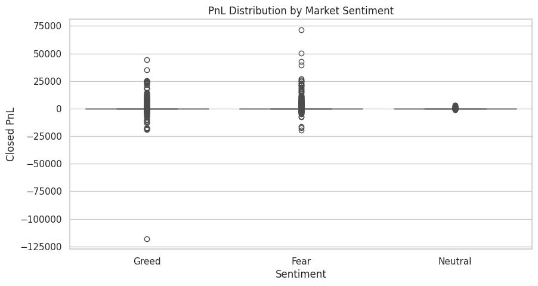
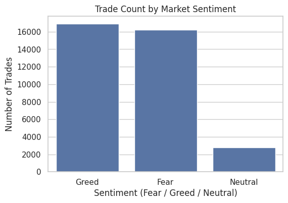
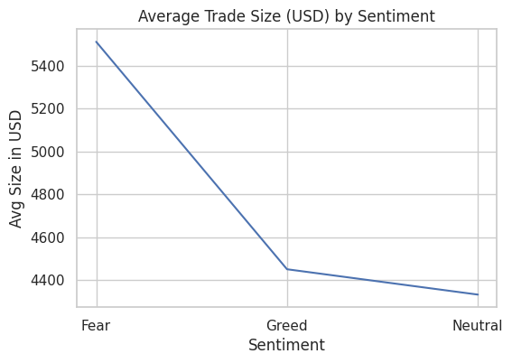
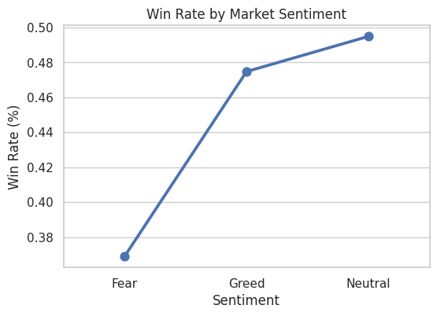

# trader-behavior-insights
Analysis of trader performance vs Bitcoin market sentiment (Fear &amp; Greed Index)
# 🧠 Trader Behavior Insights: Fear vs Greed Analysis

Analyzing how trader performance on Hyperliquid changes with Bitcoin market sentiment using the Fear–Greed Index.

---

## 📌 Project Overview

This project explores how market sentiment (Fear vs Greed) affects trader performance on the Hyperliquid platform.  
By combining historical trade data with the Bitcoin Fear–Greed Index, I analyze how profitability, win rate, position size, and behavior change under different sentiment conditions.

The goal is to understand whether traders behave more rationally or emotionally during Fear vs Greed phases, and what successful traders do differently from the rest.

---

## 📂 Datasets

### 1️⃣ Hyperliquid Historical Trades (`historical_data.csv`)

Key columns:
- `Account` – unique trader identifier  
- `Coin` – asset being traded (BTC, ETH, etc.)  
- `Execution Price` – price at which trade was executed  
- `Size Tokens` / `Size USD` – trade size  
- `Side` – buy/sell or long/short direction  
- `Timestamp` – time of the trade  
- `Start Position` – position size before this trade  
- `Closed PnL` – realized profit or loss  

---

### 2️⃣ Bitcoin Fear–Greed Index (`fear_greed_index.csv`)

Key columns:
- `timestamp` – time of sentiment measurement  
- `value` – sentiment score (0–100)  
- `classification` – Fear, Greed, Extreme Fear, Neutral  
- `date` – used for merging with trade dataset  

I merge these datasets on the `date` column to study how trade outcomes differ under different sentiment regimes.

---

## 🎯 Objective

To analyze how trader performance (PnL, win rate, and trade size) changes across different market sentiment phases (Fear vs Greed), and to identify behavioral patterns that separate profitable traders from unprofitable ones.

---

## 🛠 Methods & Approach

1. **Data Cleaning**
   - Converted timestamps to proper datetime format  
   - Handled missing or invalid values  
   - Created a consistent `date` column for merging datasets  

2. **Feature Engineering**
   - Simplified sentiment into `Fear`, `Greed`, and `Neutral`  
   - Created binary `is_win` feature  
   - Aggregated PnL, win rate, and trade size  

3. **Exploratory Data Analysis (EDA)**
   - PnL distribution across sentiment states  
   - Win rate comparison  
   - Trade count and trade size analysis  
   - Behavior of top vs bottom traders  

4. **Visualization**
   - Bar charts  
   - Line charts  
   - Boxplots  
   - Point plots  

---

# 📊 Visual Insights

Below are key charts generated from the dataset.

---

## **📌 PnL Distribution by Market Sentiment**



### 🔍 Insight  
- Fear shows the deepest negative PnL outliers  
- Greed shows more high-profit trades  
- Neutral markets have minimal extreme movement  

---

## **📌 Trade Count by Market Sentiment**



### 🔍 Insight  
- Traders are most active in Greed  
- Fear also sees heavy trading activity  
- Neutral sentiment = lowest trade volume  

---

## **📌 Average Trade Size (USD) by Sentiment**



### 🔍 Insight  
- Traders take the **largest positions in Fear**  
- Greed encourages moderately large trades  
- Neutral periods lead to smaller, controlled trades  

---

## **📌 Win Rate by Market Sentiment**



### 🔍 Insight  
- Win rate is lowest during Fear  
- Win rate rises during Greed  
- Win rate is highest in Neutral → most stable environment  

---

# 🧩 Key Insights Summary

- 📈 **Traders perform better during Greed**  
  Clear market trends improve profitability and win rate.

- ⚠️ **Fear phases produce deeper losses**  
  High volatility leads to emotional and poorly timed trades.

- 🏆 **Top traders manage risk intelligently**  
  They reduce leverage during Fear and avoid emotional decision-making.

- 🧩 **Sentiment acts as a strong risk indicator**  
  Helps anticipate volatility and adjust risk exposure.

---

## ▶️ How to Run This Project

1. Clone the repository:
   ```bash
   git clone https://github.com/Sateeshkumar4425/trader-behavior-insights.git
   cd trader-behavior-insights
2. (Optional) Install dependencies:

pip install -r requirements.txt
3. Launch Jupyter Notebook:

jupyter notebook
4.Open the notebook and run all cells in order.

👤 About Me

Name: Patlegar Sateesh Kumar
Role: Aspiring Junior Data Scientist | Web3 & Crypto Analytics Enthusiast

💼 Open to data science, analytics, and quant roles

📧 Email: patlegarsateeshkumar@gmail.com

🔗 LinkedIn: https://www.linkedin.com/in/patlegar-sateesh-kumar-868870258/
